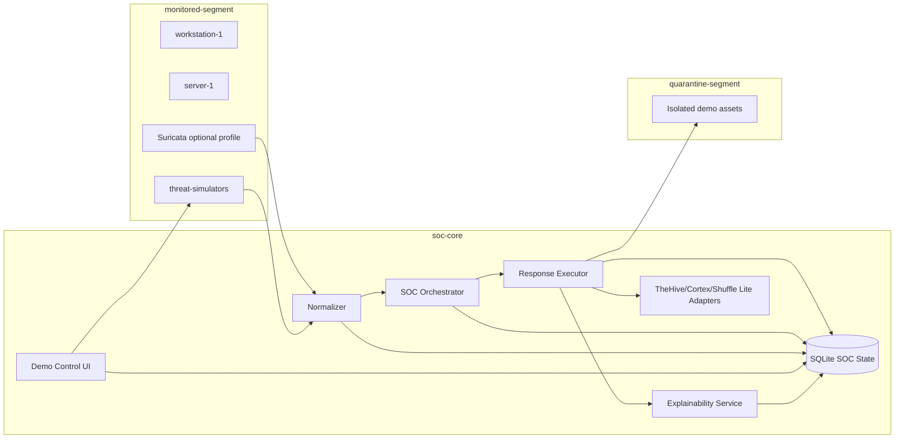

# Agentic SOC Core

Agentic SOC Core is a local, open-source, Docker Compose security operations demo that replaces a large portion of repetitive L1 triage work for controlled demonstrations. It ingests Suricata-like and Wazuh-like events, normalizes them into a common schema, correlates incidents, applies deterministic policy, executes safe demo containment, opens local TheHive-style cases, runs local Cortex-style analyzers, triggers Shuffle-style workflows, and generates HTML/PDF incident reports.

This repository intentionally defaults to a reliable **lite mode**. Heavy products such as Wazuh, TheHive, Cortex, Shuffle, and OpenSearch are represented by working local adapters and documented swap points. Optional Suricata and OpenSearch Compose profiles are included for extension.

## Architecture



## Components

- `normalizer`: Ingests Suricata EVE JSON, Wazuh alerts, and already-normalized events.
- `soc-orchestrator`: Correlates events, scores confidence, applies policy, builds timelines, and dispatches actions.
- `response-executor`: Executes reversible demo-safe containment and integration actions with rollback text.
- `explainability-service`: Produces JSON audit records, HTML reports, and PDF reports.
- `demo-control-ui`: Local web UI for incidents, actions, events, reports, health links, and scenario triggers.
- `threat-simulators`: Safe adversary emulation for beaconing, suspicious scripts, brute force, exfil-like bursts, persistence-like behavior, downloads, and reverse-shell-like callbacks.
- `integration-adapters`: Working local adapters for TheHive, Cortex, and Shuffle API boundaries.

## Run

Requirements:

- Docker
- Docker Compose plugin
- GNU Make

```bash
make up
```

On Windows without GNU Make, use the included wrapper:

```powershell
.\soc.cmd up
```

Open:

- Demo UI: <http://localhost:8080>
- Normalizer API: <http://localhost:8001/docs>
- Orchestrator API: <http://localhost:8002/docs>
- Response Executor API: <http://localhost:8003/docs>
- Reports API: <http://localhost:8004/docs>
- TheHive Lite: <http://localhost:8010/thehive>
- Cortex Lite: <http://localhost:8010/cortex>
- Shuffle Lite: <http://localhost:8010/shuffle>

## Production-Secure Mode

For a hardened internal deployment baseline:

```bash
cp .env.production.example .env.production
# Replace every CHANGE_ME value, then:
docker compose -f docker-compose.yml -f docker-compose.production.yml --env-file .env.production up -d --build
```

Windows PowerShell:

```powershell
copy .env.production.example .env.production
.\soc.cmd prod-up
```

Production mode enables API-key auth, startup failure on demo secrets, secure headers, manual approval gates for containment actions, localhost-only port bindings, dropped Linux capabilities, and `no-new-privileges`. See [docs/production-deployment.md](docs/production-deployment.md).

## Local Ollama Analyst

The orchestrator can use a local Ollama model as an analyst decision layer. Ollama recommends the triage disposition, confidence adjustment, hypotheses, next steps, and actions. Deterministic policy and production approval gates still control what executes.

Start production mode with Ollama:

```powershell
.\soc.cmd prod-ai-up
```

Configured defaults:

```env
OLLAMA_ENABLED=true
OLLAMA_URL=http://ollama:11434
OLLAMA_MODEL=qwen2.5:3b-instruct
```

Details: [docs/ollama-analyst.md](docs/ollama-analyst.md).

## Demo

```bash
make demo-scenario-1
make demo-scenario-2
make demo-scenario-3
make generate-reports
```

PowerShell equivalent:

```powershell
.\soc.cmd demo-scenario-1
.\soc.cmd demo-scenario-2
.\soc.cmd demo-scenario-3
.\soc.cmd generate-reports
```

Reports are stored in the `soc-reports` Docker volume under `/data/reports/<incident-id>/` and are downloadable from the UI.

## Separate Demo Attack Tool

A standalone benign attack runner is available at [tools/demo-attack-runner](tools/demo-attack-runner). It is separate from the production UI and only sends safe demo telemetry.

PowerShell:

```powershell
.\attack.cmd list
.\attack.cmd run outbound-beacon --mode direct
.\attack.cmd run suspicious-script --mode direct
.\attack.cmd run bruteforce-success --mode direct
```

Shortcut wrapper commands:

```powershell
.\soc.cmd attack-list
.\soc.cmd attack-beacon
.\soc.cmd attack-script
.\soc.cmd attack-bruteforce
```

Dedicated PowerShell files:

```powershell
powershell -NoProfile -ExecutionPolicy Bypass -File .\tools\demo-attack-runner\ps1\Run-OutboundBeacon.ps1
powershell -NoProfile -ExecutionPolicy Bypass -File .\tools\demo-attack-runner\ps1\Run-SuspiciousScript.ps1
powershell -NoProfile -ExecutionPolicy Bypass -File .\tools\demo-attack-runner\ps1\Run-BruteforceSuccess.ps1
powershell -NoProfile -ExecutionPolicy Bypass -File .\tools\demo-attack-runner\ps1\Run-AllCoreScenarios.ps1
```

Phone-controlled demo attack console:

```powershell
powershell -NoProfile -ExecutionPolicy Bypass -File .\tools\demo-attack-runner\ps1\Start-MobileAttackConsole.ps1
```

Open the printed tokenized LAN URL on your phone while connected to the same Wi-Fi.

Phone-controlled Atomic backend:

```powershell
powershell -NoProfile -ExecutionPolicy Bypass -File .\tools\demo-attack-runner\ps1\Start-MobileAttackConsole.ps1 -Backend atomic
```

For phone taps to execute real Atomic tests, `.env.atomic` must explicitly enable execute mode and contain selected test numbers. The system will not execute all tests for a technique from a phone button.

Atomic Red Team bridge:

```powershell
.\soc.cmd attack-beacon
.\soc.cmd attack-script
.\soc.cmd attack-bruteforce
```

These now route through the Atomic Red Team bridge by default. The generated `.env.atomic` starts in `Preview` mode. Real Atomic execution requires `.env.atomic` to set `ATOMIC_DEFAULT_MODE=Execute`, `ATOMIC_REAL_ATTACKS_ENABLED=true`, and explicit test numbers for the scenario.

Direct execution example:

```powershell
powershell -NoProfile -ExecutionPolicy Bypass -File .\tools\atomic-red-team\Run-Atomic-SuspiciousScript.ps1 -Mode Execute -TestNumbers 1 -IUnderstandRisks
```

For safe telemetry without executing Atomic tests:

```powershell
powershell -NoProfile -ExecutionPolicy Bypass -File .\tools\atomic-red-team\Invoke-AgenticAtomic.ps1 -Scenario suspicious-script -Mode EmitTelemetry
```

Docker profile:

```powershell
docker compose --profile demo-attacks run --rm demo-attack-runner run outbound-beacon --mode direct --normalizer-url http://normalizer:8000
```

## Demo Scenarios

- Scenario 1: Suspicious outbound beacon / C2-like traffic. Repeated callbacks are normalized, correlated, blocked in the demo firewall state, quarantined in demo state, cased, and reported.
- Scenario 2: Suspicious script execution. Encoded command and download-execute patterns are normalized, scored, killed as benign simulated process markers, artifacts are collected, cased, and reported.
- Scenario 3: Brute force + anomalous success. Failed logins followed by success are correlated, source IP is blocked in demo state, a case is created, and a report is generated.
- Bonus: Exfiltration-like burst, persistence-like behavior, suspicious download, and reverse-shell-like callbacks.

## What Is Simulated vs Real

- Real: FastAPI services, schemas, deterministic scoring, policy engine, SQLite state, case/action/audit records, report generation, Compose networking, UI, tests, safe scenario triggers.
- Lite adapter: TheHive, Cortex, and Shuffle are working local adapters with compatible conceptual workflows.
- Optional: Suricata and OpenSearch services are available with Compose profiles but are not required for the default demo path.
- Simulated: Malware behavior, process killing, firewall enforcement, and quarantine are demo-safe state changes by default. They never alter the host firewall.

## Security Disclaimer

This project is a defensive SOC demonstration environment. It does not include malware and does not run destructive payloads. Auto-response defaults to `active-demo`, which only changes local SOC demo state. Docker socket control is disabled by default and guarded by labels if you choose to extend it.

## Troubleshooting

- If services are stale, run `make reset`.
- If PowerShell says `make` is not recognized, run `.\soc.cmd up` and `.\soc.cmd demo-scenario-1` instead.
- For production mode, copy `.env.production.example` to `.env.production` and replace all `CHANGE_ME` values before running `.\soc.cmd prod-up`.
- If reports are missing, run `make generate-reports` after triggering a scenario.
- If `make test` fails due to missing local Python dependencies, install `requirements-dev.txt` in a virtual environment.
- If a PDF renderer fails in a non-Docker shell, the service writes a fallback PDF and the full HTML report remains available.

## Screenshots

Place stakeholder screenshots in `docs/screenshots/`. Suggested captures:

- Demo UI incident table after all three scenarios.
- PDF report title page.
- TheHive Lite case response.
- Orchestrator `/docs` API page.
