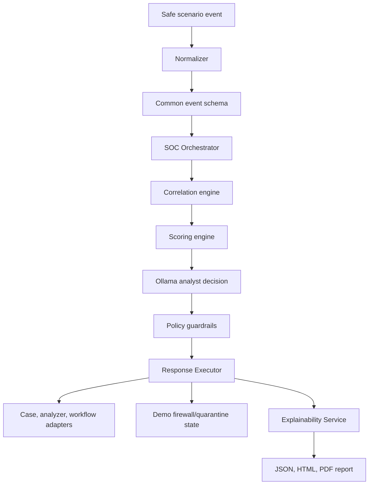
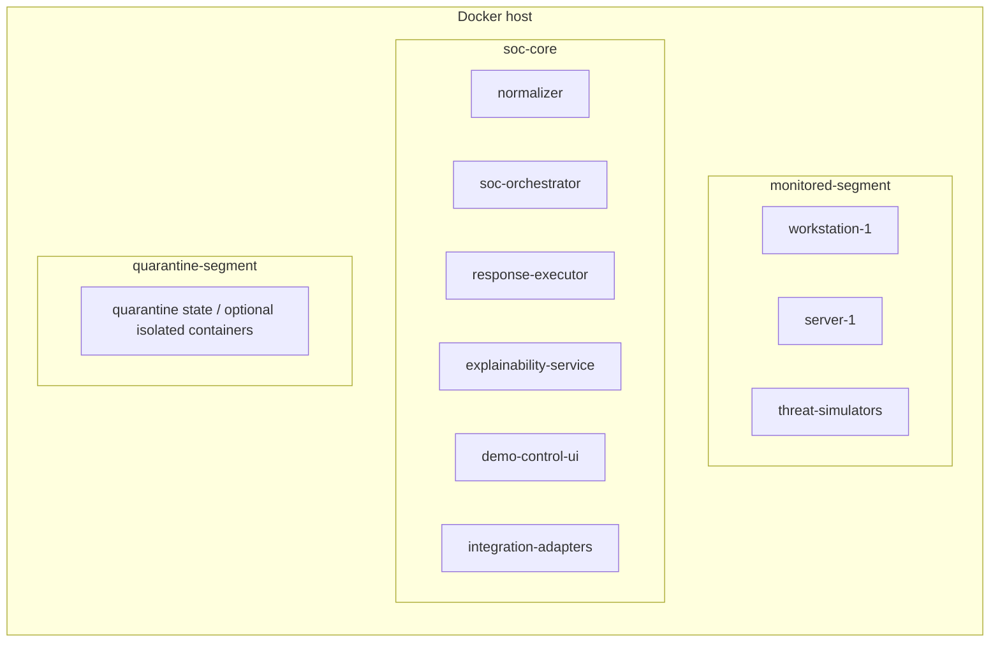
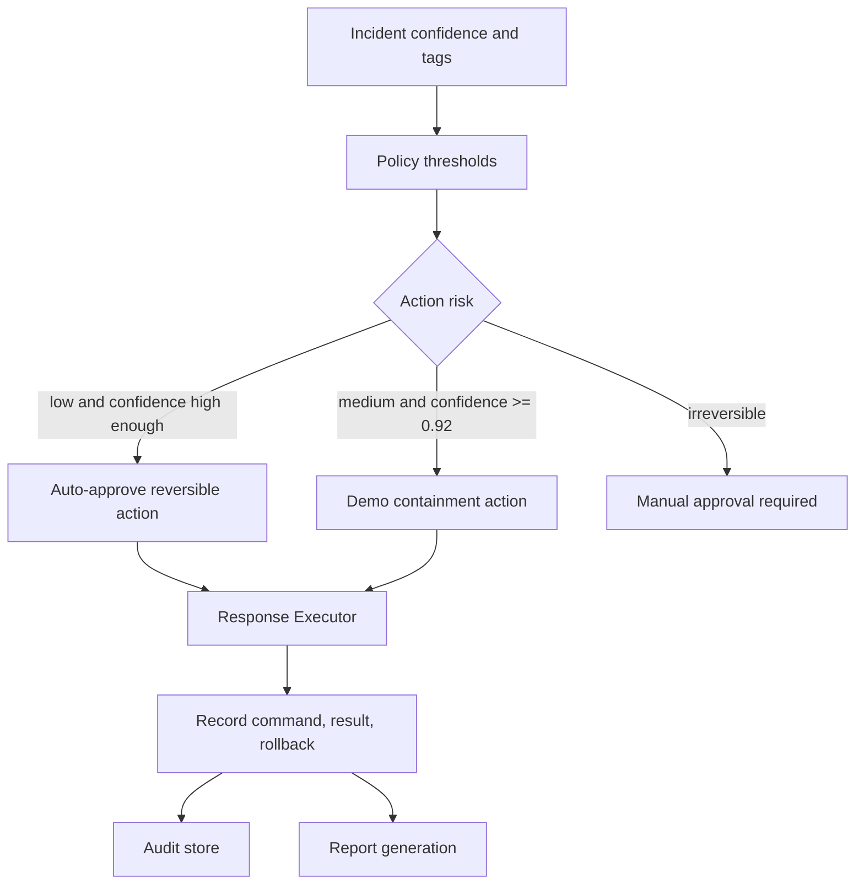
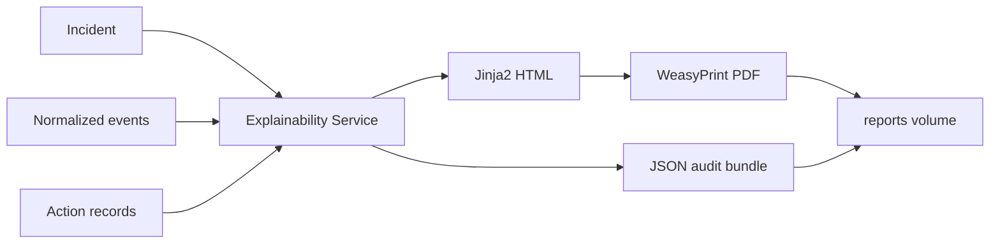

# Architecture

AegisCore uses three layers: detection/ingest, triage/response, and explainability/reporting.

The default mode is intentionally lightweight and deterministic. Full Wazuh/TheHive/Cortex/Shuffle deployments can replace the lite adapters by updating the client URLs and credentials in `.env`.

## Automated Response Flow

## Report Generation Flow

